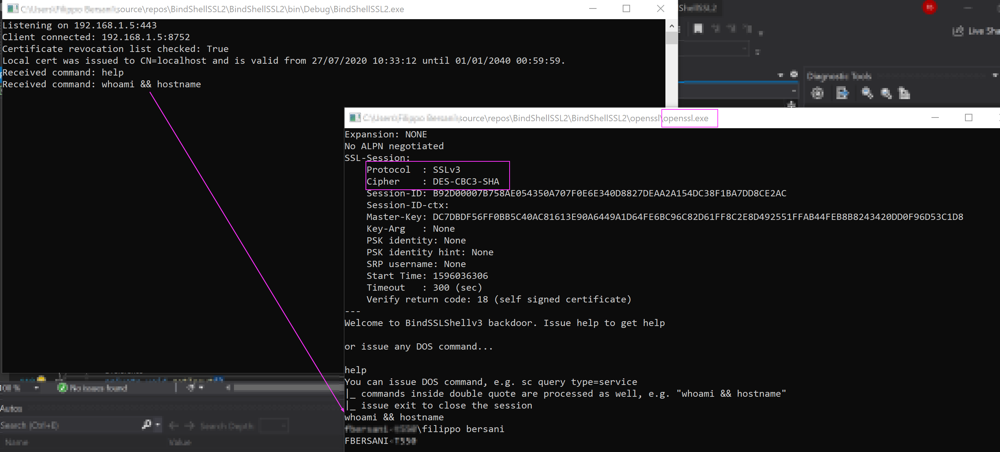

# BindSSLShell
### V3

How to BSOS [Bindshell over SSL] ver 3.0

* -Server: BindSSLShell.exe, console application coded in C# (FW Net 3.5) IDE Visual Studio CE 2019
* -Client: Any machine with openssl installed
 
On the server side

1. create the certificate:
   1. move to the makecert location, in my case C:\Program Files (x86)\Windows Kits\10\bin\10.0.17763.0\x64
   1. open a cmd as administrator and execute the following: 
   >makecert.exe -r -pe -n "CN=localhost" -sky exchange -sv server.pvk server.cer
   1. enter required password, then execute: 
   >pvk2pfx -pvk server.pvk -spc server.cer -pfx server.pfx
   1. enter required server password

1. the server.pfx file must exist on the same executable folder	
In our client machine issue the following to connect to the server:
`openssl s_client -connect 192.168.1.5:443`

1. issue help to get a brief <b>help</b>. The client console accept standard DOS command
 

